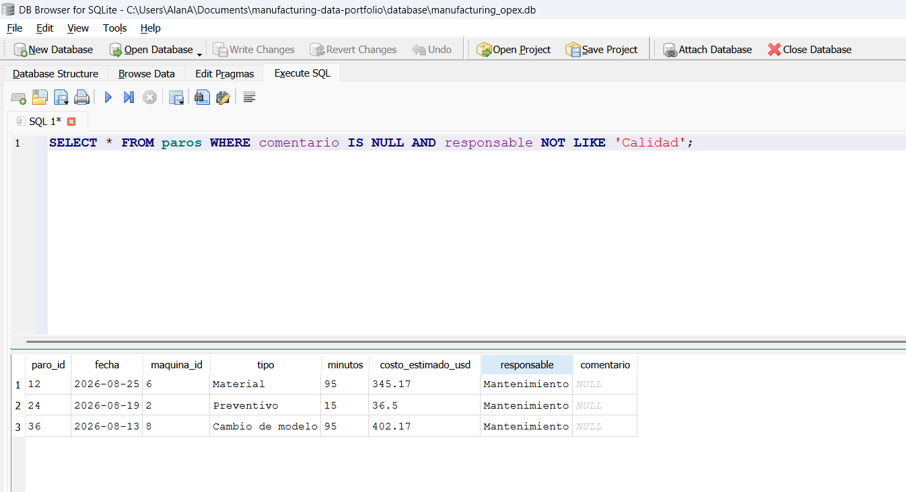

# Reto Día 2 — Filtros y ordenamiento

Nombre:  Alan Daniel Ascencio Gutierrez
Fecha: 15/sep/2026

## Pregunta 1
Pregunta de negocio: ¿Cuáles son las órdenes completadas del turno A con un costo de operación mayor a 1,200 USD?
Consulta utilizada: número 13 de `dia-02-filtros.sql`.
Respuesta basada en los resultados: se encontraron 6 órdenes.

## Pregunta 2
Pregunta de negocio: ¿Cuáles son las órdenes de los productos Carcasa AX, Engrane CX o Panel EX fechadas entre el 10 y el 20 de agosto de 2026, ordenadas por costo de operación de menor a mayor?
Consulta utilizada: número 14 de `dia-02-filtros.sql`.
Respuesta basada en los resultados: Se encontraron 12 órdenes.

## Pregunta 3
Pregunta de negocio: ¿Cuáles son los paros sin comentario y con responsable que no es calidad?
Consulta utilizada: número 15 de `dia-02-filtros.sql`.
Respuesta basada en los resultados: se encontraron 3 paros.

## Hallazgo principal
Un gerente de planta debería enfocarse primero en conocer las órdenes de producción con estado en proceso o que no se han completado. Posteriormente se revisaría la cantidad de paros de línea que se tienen como pendientes de cierre para poder priorizar la producción pendiente pero con un enfoque en calidad, esto requeriría que se desginen responsables para cada contramedida pendiente y poder cerrarlas a la brevedad, en caso de no ser posible, alinear contramedidas inmediatas (como retrabajos, confirmaciones adicionales, refuerzo de operaciones, entre otras) que permitan continuar con la producción y mantener primero la calidad. Por último, lo ideal sería identificar cuales serían las máquinas que tienen mayor criticidad y que se encuentran fuera de servicio, para asignar a los responsables de corregirlas que puedan hacerlo, y con ello atacar también este flanco debilitado por falta de equipos en funcionamiento.

